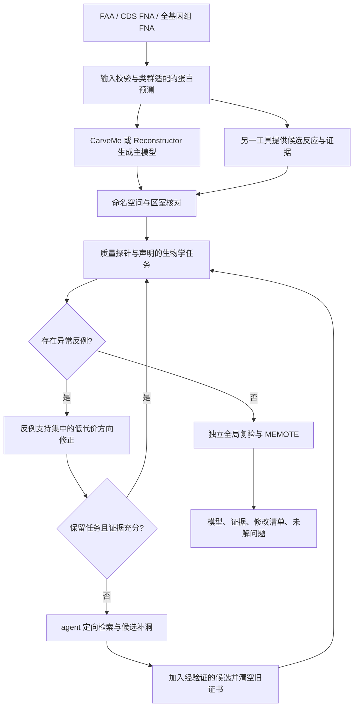

# 反例驱动、证据定向的代谢网络重建方案

日期：2026-09-09。工作名：CER（counterexample-guided evidence reconstruction）。
状态：算法设计 + 独立质控内核原型；未完成 FAA/FNA 到模型的端到端性能验证。

## 1. 建议与实现边界

建议保留 CarveMe 或 Reconstructor 作为初稿生成器，把算法创新集中到一个可独立运行的
“反例发现 → 小范围修正 → 定向补证据 → 受约束补洞 → 全局复验”循环。
第一版只需要一个 agent、一个 LP 求解器和可追溯的证据表，不需要多个 LLM 互相讨论、
训练大型模型，也不需要把整个反应库都交给 LLM。

用户没有进一步指定优先级时，本方案采用“质量与速度兼顾，先验证细菌”的假设。
细菌属于原核生物；后续按细菌、古菌、真核生物分别扩展。真核能力是待实现扩展，
不能由支持 SBML 格式或更换 biomass 名称推导出来。

本次没有读取 MQC 的算法实现，没有进入 `C:/jupyter/pear` 或使用 pear 环境。
不导入、调用、改名移植这两个项目，也不使用其私有规则表、数据库、训练产物或中间输出。
不把旧系统跑出的答案当作新算法监督信号。MEMOTE 从公开上游接入，避免依赖 pear 包装。
公开文献中的 FBA、产能循环检测、最少修改思想需要正常引用，不作为个人原创声明。

本次只在 `experiments/counterexample_repair/` 新建研究原型，并补充研究文档；
没有改动 `src/GemAgents`、CarveMe、Reconstructor、MQC 的原有代码。

## 2. 当前项目与输入问题

| 已检查项目 | 发现 | 对方案的影响 |
|---|---|---|
| `src/GemAgents/agent.py`、`tools.py` | LangGraph 工具循环、shell、文件、任务与记忆已存在；尚无代谢专用接口 | 可以承接状态机和工具调用，不能把两个目录的存在当成已完成集成 |
| CarveMe 本地 `setup.py` | 版本标为 1.6.6；依赖 reframed | 初稿经 SBML 转为统一 COBRApy 对象 |
| Reconstructor 本地 `pyproject.toml` | 1.2.0，依赖 COBRApy；资源含 ModelSEED 系列 universal SBML | 保留其原始命名空间，通过明确映射提供候选 |
| 本地公开 CarveMe benchmark | 含 6 个 FAA、参考模型和表型相关文件 | 可作为后续重建基准起点；先核对菌株、数据来源及是否用于调参 |
| 当前环境 | 默认 Python 3.13.9；文档中的 `gemagents` conda 环境不存在 | 本次使用独立 `.venv-research`，不借用 pear 环境 |

必须区分三种输入：

1. **FAA 蛋白序列**：检查空序列、重复 ID、非法字符，保留蛋白 ID 与基因 ID 映射。
2. **逐 CDS 的 FNA**：核对编码方向、遗传密码与翻译规则；CarveMe `--dna` 支持的是这种输入。
3. **全基因组/contig FNA**：先进行类群适配的基因预测，再产生 FAA。不能把整条染色体
   直接当成一个蛋白编码基因。原核和真核的基因预测、剪接处理及定位预测需要不同前端。

CarveMe 官方使用说明明确区分逐基因 DNA 与原始全基因组；Reconstructor 常规重建入口是
氨基酸 FASTA。这是需要先修正的输入链路问题，而非通过模型后处理弥补。
[CarveMe 使用说明](https://carveme.readthedocs.io/en/latest/usage.html)，
[Reconstructor 官方仓库](https://github.com/csbl/reconstructor)。

## 3. 哪些内容已经有公开先例

| 方法 | 已有贡献 | 本方案不能把什么当成新发现 |
|---|---|---|
| CarveMe，2018 | 基因证据驱动 carving、已整理的 universal model、加权 gap filling、ensemble | 基因加权、模板整理、多个候选模型本身 |
| Reconstructor，2023 | COBRApy 兼容的重建与 parsimonious flux gap filling | pFBA 补洞或把重建接到 Python 本身 |
| Fritzemeier 等，2017 | 无摄取时检测能量耗散通量，最少方向修改，保留生长 | “检测免费 ATP + 少删反应 + 保留 biomass” |
| OptFill，2020 | 避免不合理循环的 gap filling | “补洞同时防环”这个总体目标 |
| Fast-SNP，2016；局部 loopless constraints，2018 | 缩小求解问题、加速 loopless 分析 | “局部化求解”本身 |
| MEMOTE，2020 | 模型结构、注释、一致性等标准化测试 | 重新包装其总分 |
| Human2/LLM curation，2026 | LLM 辅助人类代谢模型整理 | “首次用 LLM 整理 GEM” |

依据：[CarveMe](https://doi.org/10.1093/nar/gky537)、
[Reconstructor](https://doi.org/10.1093/bioinformatics/btad367)、
[EGC/GlobalFit](https://doi.org/10.1371/journal.pcbi.1005494)、
[OptFill](https://doi.org/10.1016/j.isci.2019.100783)、
[Fast-SNP](https://doi.org/10.1093/bioinformatics/btw555)、
[局部 loopless constraints](https://academic.oup.com/bioinformatics/article/34/24/4248/5026660)、
[MEMOTE](https://doi.org/10.1038/s41587-020-0446-y)、
[Human2](https://doi.org/10.1073/pnas.2516511123)。
更有研究价值的候选贡献是：**在同一个可验证重建循环中，利用反例压缩动作空间，
利用可行域包含关系复用检查结果，并仅对影响决策的证据缺口调用 agent。**
这是待证实的组合方法贡献；有限文献核查不足以认定全球首次，更不能给出发表保证。

## 4. 整体流程



首版固定一个主模型，另一个模型只供检索候选。不要直接把两个反应集合取并集，也不要
将交集当作可信真值。两种工具的参考库和注释证据可能相关，二者都支持并不等于两次独立证实。

速度路线可以按需才调用第二个重建器；对照实验则必须同时包含“始终运行两个工具”与
“按需运行第二工具”，否则无法判断省下的时间来自调度还是修正算法。

## 5. 候选映射与证据表

用公开 MetaNetX/Rhea/原数据库交叉引用建立映射。对每个候选再次核对代谢物身份、
计量系数、正反方向、区室和质子约定。同名不能直接合并；一个交叉引用也不能自动消除
一对多或跨区室歧义。代谢物区室不同、异构体不同、质子化形式不同的条目保留待核对状态。
公开 MetaNetX 的作用是提供资源间协调基础，并非所有映射都是可直接替换的生化等式。
[MetaNetX 更新论文](https://pmc.ncbi.nlm.nih.gov/articles/PMC12807685/)。

建议记录：

```text
reaction_candidate_id / source_namespace / source_reaction_id / source_version
canonical_metabolite_ids / compartment / normalized_stoichiometry
allowed_forward / allowed_reverse / mapping_status / mapping_evidence
query_gene_ids / target_protein_ids / alignment_score / identity / coverage
GPR / enzyme_complex_completeness / annotation_method
source_model / gapfilled_or_sequence_supported / provenance
evidence_forward / evidence_reverse / uncertainty / protected_reason
```

不同 DIAMOND 数据库的分数不能直接互比。先在每个引擎内部按可复现规则归一化，
保留原始分数；复合酶需要检查 AND 子单元，不能凭一个亚基就赋予完整反应证据。
置信度第一版是排序分值，不包装成已校准的概率。缺少基因证据也不等于反应不存在，
尤其是 MAG 不完整、远缘物种或运输反应。

## 6. 核心数学与修正策略

### 6.1 先界定能证明什么

稳态模型满足 `S v = 0, l ≤ v ≤ u`。这只表示模型内部计量约束满足，
不自动证明真实原子守恒、无免费能量或生物学正确。

检测分三层：

- **静态元素/电荷审计**：已知分子式部分检查 `A S` 和电荷残差；报告缺失式、R 基、
  通式、biomass/维护/边界伪反应的覆盖率和豁免理由。不能把缺少分子式算作平衡。
- **物质产生检测**：关闭所有外部边界和声明的 biomass/伪反应，在测试副本中为每个
  代谢物增加非负 drain `d_i`，求 `max Σd_i`，约束 `S v - d = 0`。
  任一正值是“存在非负净物质输出”的反例。联合 drains 避免逐代谢物反复求解，
  并允许同时排出伴随产物。逐项定位可以在失败后再做。
- **能量产生检测**：单独加入 ATP 水解等耗散反应并最大化其通量。ATP 例子是
  `ATP + H2O → ADP + Pi + H+`。GTP、NAD(P)H、醌类及跨膜质子梯度需要独立探针。
  缺失组成分子或区室时标为 `not_applicable`，不补造代谢物然后报告通过。

无摄取条件下的能量耗散检测已有公开先例；某些电子载体耗散探针是诊断用伪反应，
不等同于可写入最终模型的生化反应。[EGC 方法](https://doi.org/10.1371/journal.pcbi.1005494)。

**边界语义必须写进报告。** 本次内核只实现严格关闭所有结构性边界及显式指定反应的模式。
完整算法还应增加“禁止营养/光子/电子供体摄取，允许声明的废物外排”的诊断模式；
水/质子缓冲是否开放需要单独定义。两种模式不能共享证书。光合模型不能把光子当成
无代价输入，跨膜质子探针也不能因开放质子交换而误判。正式结论须限定测试条件。

维护反应的强制下界可能使无营养模型不可行。原型在审计副本中将强制通量放宽到包含零，
逐项记录，原模型保持原界限；正常生长任务仍使用其原始维护要求。
求解超时、不可行、无界和数值残差超限均不是通过。

### 6.2 用反例缩小候选范围

检测到正的异常目标后，固定一个可检测的异常水平，最小化绝对通量和得到较简约的
反例向量 `v*`。它是可行反例，不保证是最短路径或最小基数循环。

只考察反例中活动的内部反应方向。例如 `v*_r < 0` 时先考虑禁止反向通量，保留正向。
exchange、biomass、任务目标与用户保护反应不作为自动删改对象。

收集多个反例 `W_j` 时，对方向动作 `a` 可以用下式排序：

`priority(a) = 覆盖的当前反例数 / (edit_cost(a) + ε)`。

其中 `edit_cost` 随方向证据强度、保守核心功能与来源可信度提高；无基因证据的
gap-filled 方向可先检查，但并非必须删除。实际原型使用更简单的“证据代价升序”，
覆盖度排序留作对照版本。

每次只应用一个候选限制，重跑声明的生长/代谢任务。任务受损则撤销该限制，记录
失败原因，尝试下一个候选。若所有单步限制都不满足要求，输出冲突状态，并进入
补证据或补洞流程。不要删掉 biomass、打开所有营养输入或关闭所有反应来换取零泄漏。

有限预算内贪心未找到解不代表不存在解，发现一个反例并切断也不代表没有其他反例。
因此必须循环复验。小范围 MILP 可作为第二阶段回退：对方向删除变量 `z_a` 加
`Σ(a∈W_j) z_a ≥ 1` 的反例覆盖约束，同时保留每个任务的可行通量。
这是已知反例集合上的近似约束，不是对所有循环的一次性证明；新解仍要接受探针验证。
反应添加/改计量时需重新生成反例与其适用前提。

### 6.3 可以严格说明的加速条件

若仅收紧边界，则对同一计量矩阵、同一探针、同一关闭规则与同一其他约束，有：

`F_new ⊆ F_old  ⇒  max(F_new, probe) ≤ max(F_old, probe)`。

因此，旧模型中已证明“不超过阈值”的探针，在新模型中仍不超过阈值，可以复用。
这是可行域包含关系的直接性质，不宣称该数学性质本身是新定理。

**反应添加、解除限制、改变系数、区室、探针、水/质子规则、自定义约束或求解容差
时必须失效缓存。** 单凭“新反应离异常很远”不能继续复用旧证书；长程回路可能被接通。
成功结果必须绑定模型/约束指纹，不能只绑定文件名。最终交付前独立关闭缓存复验。

原型包含此缓存规则，但仍为每个实际求解建立审计副本，尚无 LP basis warm start。
减少 LP 次数不必然减少总时间；模型复制、指纹生成与外部注释费用都要计入。

## 7. agent 的可检验贡献

agent 在候选冲突时解决“接下来值得查哪条证据、尝试哪项有依据的动作”，由确定性
工具负责计量、求解和最终接受。它不生成未经核对的化学式、反应式、EC 注释或 GPR。

一个预算内的证据优先级可定义为：

`query_value(r) = uncertainty(r) × affected_witnesses(r) × task_impact(r) / estimated_cost(r)`。

这是待验证启发式，不是已训练好的信息增益模型。`uncertainty` 来自工具分歧、映射
歧义或注释覆盖不足；`task_impact` 来自候选限制时真实任务结果，不靠 LLM 自报置信度。
第一版可设每模型最多 10 个检索问题、单问题最多 2 次工具回合，并对超预算输出待解问题；
这些是建议实验预算，需要在开发集上固定，而非声称最优参数。

允许的结构化动作：`request_sequence_evidence`、`resolve_mapping`、
`propose_direction_limit`、`propose_candidate_addition`、`request_biomass_template_review`。
每个提案包含候选 ID、来源 URL/数据库版本、匹配证据、预期影响和依据缺口。
只有通过格式校验、来源核对、计量检查和 LP 任务验证后，工具才接受提案。

应重点检索：运输方式是否错配、ATP/PPi 等方向是否被放宽、复合酶缺亚基、
某条补洞通路是否真的有蛋白证据、区室定位是否合理。无法判断就保留待解状态。
把每条反应都送给 LLM 会增加成本，也难以证明 agent 必要。

要证明 agent 贡献，比较同样证据预算下的：无 agent 确定性排序、随机查证、
固定规则查证、反例/任务影响驱动查证。锁定模型版本、提示词、温度和检索快照，
记录 tokens、调用次数、来源有效率、验证拒绝率及每次查证带来的任务收益。
没有这组消融，论文最多能证明一个自动化工作流。

## 8. 如何结合补洞与生物学任务

修正过程可能暴露原模型靠错误循环维持的生长。此时保留生长并不意味着保留该错误，
也不应强制原来的异常生长速率。优先使用实测生长范围、明确培养基、必需产物和
保守任务，避免把“原模型最优 biomass 的固定比例”当成唯一生物学真值。

完整重建阶段先检索第二工具的候选，再检索同命名空间的公开 universal 库。
只引入经过区室、计量与证据核对的候选；执行带非负反应成本的加权 pFBA 补洞。
LP 稀疏通量只作为候选支持集，不等价于最少新增反应数。若必须求最少新增数，
才在小候选集上使用 MILP，并记录求解预算与最优性状态。

每次新增后清空旧证书，重跑所有适用物质/能量探针及已声明任务。失败则撤销补洞批次，
记录禁用组合，尝试下一组。经过删除后重新加入同样方向也算添加，不能绕过复验。
只读验证集中的生长/不生长结果不得作为补洞约束。

对不同类群：

| 类群 | 先决条件 | 不应做的简化 |
|---|---|---|
| 细菌 | 匹配菌株与培养基，Gram/细胞壁相关 biomass，运输证据 | 把 Gram 判断当成全部生物学差异 |
| 古菌 | 适配古菌膜脂/辅因子、电子载体和能量耦合，验证适用模板 | 沿用细菌 biomass 就宣称支持古菌 |
| 真菌/酵母等真核 | 含内含子的基因模型、定位证据、细胞器区室、运输及适配 biomass | 把胞质和线粒体反应合并消除“死端” |
| 其他真核 | 对应类群公开模板和任务集；复杂物种可能需组织/条件限制 | 用一个通用微生物模板覆盖所有真核 |

第一轮建议用 E. coli 与 B. subtilis 调试，然后把其他菌属留作验证；不能将所有菌株
数据用于规则制定后再宣称泛化成功。

## 9. MEMOTE：保留标准分，另报行为质量

直接使用公开 MEMOTE 生成原始标准报告，固定版本与配置；不要把自定义加权分标为
“MEMOTE 分”。其意义是标准化测试，不能把总分单独当作表型预测准确率。
[MEMOTE 论文](https://doi.org/10.1038/s41587-020-0446-y)，
[官方实现](https://github.com/opencobra/memote)。

建议输出质量向量，而非首版自造单一总分：

```text
Q = (适用物质/能量探针状态与覆盖率,
     实测任务/表型指标及置信区间,
     基因与反应证据覆盖率,
     新增/限向/禁用数量及方向证据损失,
     原始 MEMOTE 分项与总分,
     运行时间/峰值内存/LP-MILP 次数/LLM 费用)
```

一个方法仅提高注释完整率、却破坏生长，不能判优。缺测是缺测，不能填成满分或零分。
同样地，无免费 ATP 不代表无 NADPH/质子梯度异常；必须报告探针分母与缺失原因。
如后续确需产品用综合分，另命名为实验性决策分，在开发集锁定权重并进行敏感性分析；
科学结论仍以原始分项、任务精度和实际代价为依据。

## 10. 验证与失败判据

### 最小基准矩阵

| 组别 | 目的 |
|---|---|
| CarveMe 原始输出 | 基线，固定输入/培养基/版本/数据库 |
| Reconstructor 原始输出 | 另一基线，相同可比任务 |
| 各初稿 + 无 agent 的 CER | 分离确定性求解改进 |
| 主模型 + 第二工具证据 + CER | 测量跨工具候选价值 |
| 完整 CER + 定向 agent 查证 | 测量 agent 增量价值 |
| 关闭证书缓存 / 无反例缩小范围 | 分离加速来源 |
| gapseq；条件允许时 OptFill/公开 EGC 修正方法 | 防止仅胜过两个弱基线就推断先进性 |

公开对照的适用范围需一致，loopless flux 分析不能直接当作模型修正方法排名。
gapseq 提供独立的微生物重建对照方向。
[gapseq](https://doi.org/10.1186/s13059-021-02295-1)。不运行 MQC 或 pear。

验证至少分三层：

1. **机制/对抗测试**：人工物质增殖、正反向错误、多个独立循环、必须保护的生长方向、
   缺失辅因子、边界方向、infeasible/timeout、缓存失效。只能说明程序与约束语义正确。
2. **公开模型扰动**：对公开 curated model 注入已知错误，比较修正方向召回率、
   正确反应误改率、任务保留与时间。知道错误位置的测试须单独标注，不能当盲定位准确率。
3. **真实重建**：同一公开 FAA/FNA、多物种、同一培养基，比较底物利用、基因必需性、
   生长/产量等独立实验数据。人工整理模型不是完整生物真值，结构重合度仅为辅助指标。

开发/验证按菌属或更高层级分割，记录序列、参考库、模板和文献证据与测试生物的重叠。
对基因必需性使用相同基因 ID 宇宙并报告缺失 GPR；不能各算法只挑预测得出的基因。
分类任务报告混淆矩阵、MCC、balanced accuracy，连续任务按数据类型报告误差；
小样本给出逐物种结果与配对置信区间，不仅报平均值。预设 noninferiority margin
后再评估速度/质量折中，避免事后调整门槛。

时间单独报告：基因预测、序列比对、初稿构建、候选映射、内核修正、agent、最终 MEMOTE；
同时报告端到端总耗时。缓存冷/热启动分别运行，固定线程与硬件，至少重复 3 次。
若注释占 90% 耗时，即使修正内核加速一倍，也不能声称整个流程加速一倍。

否定性结果同样有用：若 agent 无稳定增益则保留确定性算法；若缓存指纹开销抵消 LP
收益则简化指纹/使用持久化审计器；若局部修正误伤生物学功能则扩大任务约束和证据范围。
这些需要测量，不能预设本方法一定优于已有工具。

## 11. 落地到现有框架的分期

| 阶段 | 工作 | 交付条件 |
|---|---|---|
| P0，本次 | 有出处的方案、独立 LP 内核、对抗测试与公开模型冒烟 | 可复现实验；清楚列出未实现功能 |
| P1 | FAA/FNA 校验、类群路由、CarveMe/Reconstructor 独立进程适配、运行 manifest | 给定公开基因组可获得两份有来源的初稿 |
| P2 | 静态平衡审计、全部适用探针、映射、任务集、补洞事务 | 修改后可重算完整质量向量 |
| P3 | agent 结构化查证动作与预算调度 | 无 agent/规则/定向查证消融可运行 |
| P4 | 留出菌属验证及古菌/真核适配 | 达到各类群独立验证条件后再宣称支持 |

沿用当前 Python 特性模块：在 `tools.py` 接确定性调用，在 `agent.py` 注册工具 schema，
在 `state.py` 管运行阶段和 manifest，在现有权限/文件历史机制中管理模型输出。
重建器用独立环境/子进程承载；等待时间需适配分钟级工作，不能受普通 shell 的短超时误杀。
无需重新设计整套通用 agent。第一版可先使用已有 `run_shell` 运行本次原型。

每次运行保存：输入哈希、工具/数据库/求解器版本、种属与输入类型、培养基、biomass、
证据表、约束和探针哈希、修改前后模型、每个反例、每项接受/拒绝理由、完整报告。
未解冲突输出 `needs_evidence` 或 `incomplete`，不要把 draft 标为完成质控。

## 12. 本次已经交付什么

- [研究原型与运行说明](../experiments/counterexample_repair/README.zh-CN.md)
- [独立 CER 内核](../experiments/counterexample_repair/code/cer.py)
- [前置实验协议](../experiments/counterexample_repair/protocol.md)
- [文献核查笔记](../literature/metabolic-reconstruction/survey.md)
- [实测结果解读](../experiments/counterexample_repair/analysis.zh-CN.md)

本次没有完成从基因组运行两种重建器、没有运行完整 MEMOTE、没有调用 LLM 验证 agent
增益，也没有证据证明新方法在真实基因组上速度更快/精度更高。当前最有把握的结论是：
这条路线具备独立实现边界与可测试的技术假设，核心限制/复验机制已经能够运行。
